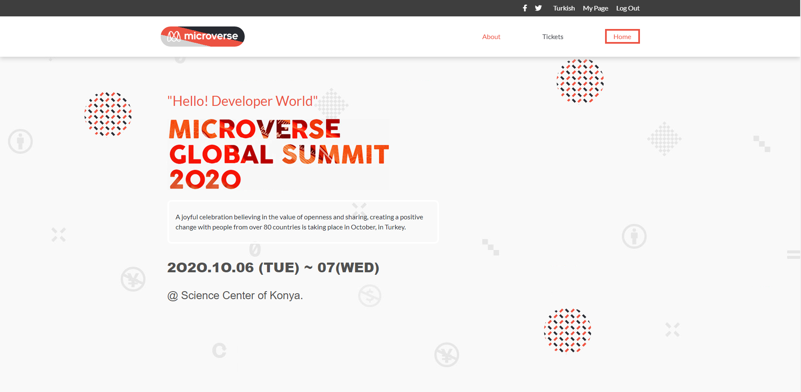
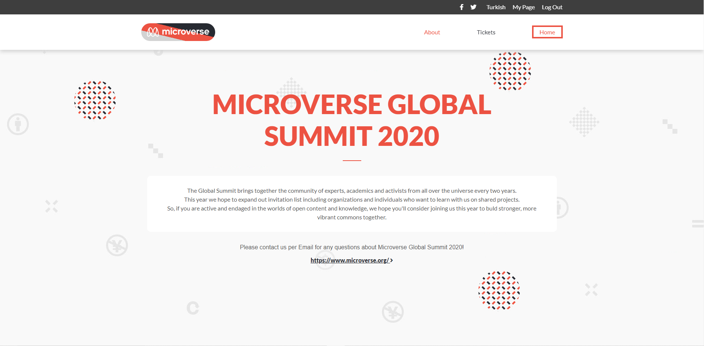
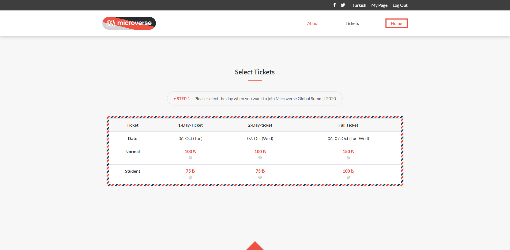
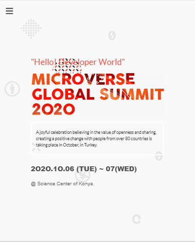
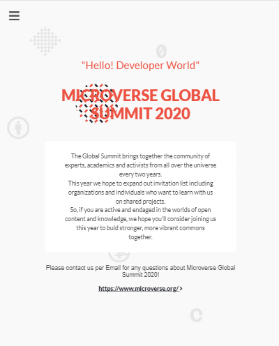
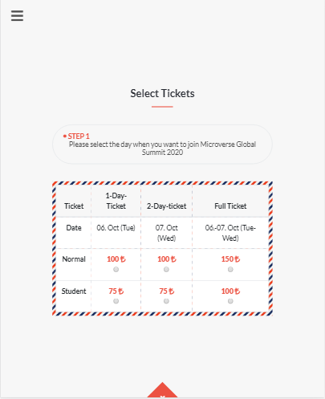

# Microverse Summit 2020

> This is the capstone project of the Microverse HTML & CSS curriculum. It makes use of float, flex and grid CSS display positioning styles. Also Bootstrap framework is mostly used. This capstone project is completed as part of the Microverse remote software developement curriculum using the pair programming approach.

## Check Video Link
[Description Video](https://www.loom.com/share/47d2ad77bf6846d49fea32d3a3ab057d) 

## Home Page

## About Page

## Ticket Page

## Home Page - Small Secreen

## About Page - Small Screen

## Ticket Page - Small Screen

## Built With

- HTML,
- CSS

## Live Demo

[Live Demo Link](https://rawcdn.githack.com/SafaErden/Microverse-Summit/a53cf913ada323dc8bd06839c92c7658aa908903/index.html)

### Prerequisites

-Any kind of browser suooprting CSS3 and HTML5

### Setup

-Fork the repo to your remote repository.
-Clone or download the repository to your local machine.

### Install

-No istallation needed.

### Usage

-Visit the live demo link on your web browser.

## Author

👤 **Safa ERDEN**

- Github: [@SafaErden](https://github.com/SafaErden)
- Twitter: [@safaerden](https://twitter.com/safaerden)
- Linkedin: [SafaErden](https://www.linkedin.com/in/safaerden/)
- Mql5: [safaerden](https://www.mql5.com/en/users/safaerden)
- Email: [safaerden](mailto:safaerden@gmail.com)

## 🤝 Contributing

Contributions, issues and feature requests are welcome!

Feel free to check the [issues page](https://github.com/SafaErden/Microverse-Summit/issues)

## Show your support

Give a ⭐️ if you like this project!

## Acknowledgments

You can access all the design info (color, typography, layouts) in this link:

[https://www.behance.net/gallery/29845175/CC-Global-Summit-2015](https://www.behance.net/gallery/29845175/CC-Global-Summit-2015)

Design idea by [Cindy Shin in Behance](https://www.behance.net/adagio07)

